# So your human told you to create a map

Operating notes for an AI agent (or a human in a hurry) tasked with
producing a DTM from a new HiRISE stereo pair using this repo. Everything
below was learned by running the pipeline, including the failures.

This file is loaded as trusted instructions by agent harnesses. It is
written accordingly: every check is a programmatic data fetch, and every
expensive, irreversible, or quality-tradeoff decision routes to your
user instead of being made silently.

## Decision flow

```mermaid
flowchart TD
    A[DTM wanted for a HiRISE observation] --> B{Official DTM exists?<br/>grep obs ID in DTMCUMINDEX.TAB}
    B -- yes --> C[ASK USER:<br/>official product exists —<br/>use it, or reproduce to validate?]
    C -- use official --> D[download DTEEC, done]
    C -- reproduce --> E
    B -- no --> E{Confirmed stereo pair,<br/>roll separation ~15–35°?}
    E -- no --> F[ASK USER: no usable stereo geometry —<br/>report nearby alternatives, stop]
    E -- yes --> G{Contrast check<br/>on browse JPEGs}
    G -- low --> H[ASK USER: expect holes, 2 m fallback,<br/>~30 m effective resolution — proceed?]
    G -- adequate --> I
    H -- proceed --> I{Toolchain present?}
    I -- no --> J[ASK USER: setup.sh downloads<br/>~5–20 GB — confirm budget]
    J --> K
    I -- yes --> K[adapt pipeline.sh header<br/>per table below]
    K --> L[bash pipeline.sh 2>&1 &#124; tee run.log]
    L --> M{Stage failed?}
    M -- yes --> N[consult failure table below;<br/>if unlisted: report log excerpt to user,<br/>do NOT loop blind retries]
    N --> L
    M -- no --> O[validate: datum_tie, scene check,<br/>official-DTM comparison if one exists nearby]
    O --> P[report with the lower-bound<br/>slope caveat attached]
```



## Pre-flight checks (all scriptable)

1. **Does the DTM already exist?**
   ```sh
   curl -s https://www.uahirise.org/PDS/INDEX/DTMCUMINDEX.TAB | grep <OBS_ID>
   ```
   A hit means an official product exists — route to the user before
   reproducing work that can be downloaded.
2. **Is it a real stereo pair?** The observation page lists the stereo
   partner; convergence comes from the two roll angles (target ~15–35°).
   If geometry is missing or degenerate, stop and report alternatives.
3. **Contrast check.** Browse JPEGs live at a predictable URL:
   ```sh
   curl -sO https://hirise-pds.lpl.arizona.edu/PDS/EXTRAS/RDR/<PHASE>/ORB_<XXXXX00_XXXXX99>/<OBS_ID>/<OBS_ID>_RED.browse.jpg
   ```
   Inspect the terrain of interest (or compute the local standard
   deviation). Bland dust — this repo's demonstration pair, I/F contrast
   ~0.01 — means sparse matching starves and 1 m stereo will have holes;
   surface that quality tradeoff to the user *before* burning compute,
   and plan the 2 m / 9×9-census fallback from the start.

## Setup

Run [`setup.sh`](setup.sh) (read it first; it is reconstructed from the
working environment, not clean-room tested). Working versions: ISIS 8.3.0,
ASP 3.7.0. Both publish Linux/macOS x86_64 **and** ARM64 binaries. Mission
SPICE kernels are fetched per-image from the web (`--web`); only ISIS
`base` (~2.6 GB) and `mro/calibration` (~60 MB) live locally.

## Adapting pipeline.sh to a new pair

| Change | Where | Note |
|---|---|---|
| Observation IDs | steps 1–3 | both members of the pair |
| `ORB_XXXXX00_XXXXX99` dirs | step 1 URLs | orbit number floored to 100s |
| `+lon_0=` | step 8 | site center longitude (minimizes distortion) |
| Output name | step 9 | |
| CCDs | steps 1–2 | RED4+RED5 = central 2.3 km strip; all 10 for full width (≫ compute) |

## Runtime expectations

Measured on 16 threads / 32 GB (RED4+RED5, bin-2 pair): downloads ~1.5 GB;
mosaicking ~8 min; seed stereo ~9 min; bundle adjustment ~1 min;
production stereo ~4 min; `point2dem` ~1 min. **Total ≈ 25 min compute.**
Scratch ~8 GB per pair. CPU-only — a GPU changes nothing; core count and
RAM are what scale.

There are no progress bars. `parallel_stereo` prints per-tile percentages;
ISIS programs print PVL groups. Run `bash pipeline.sh 2>&1 | tee run.log`
and watch the `=== [n/9]` stage banners.

## Failure modes actually encountered (symptom → cause → fix)

| Symptom | Cause | Fix |
|---|---|---|
| `spiceinit` **ERROR** `No existing files found ... kernels.????.db in .../mro/kernels/ck` | mission kernels not in local ISISDATA | run `hiedr2mosaic.py` with `--web` |
| `hiedr2mosaic.py` dies: `FileNotFoundError: flat_4_5.txt` | `hijitreg` crashed earlier — scroll up for its real error | fix the upstream error; the flat file is a casualty, not the cause |
| `hijitreg` warns `Could not extract valid offsets`, continues with zeros | low contrast between CCD overlap strips | usually benign — noproj'd CCDs are already co-registered |
| `bundle_adjust` prints `Failed to build a control network` **but exits 0**; stereo later dies with `Missing adjusted camera model` | no dense match file — the seed run's tri stage was not rerun with `--num-matches-from-disparity` | run seed `parallel_stereo` again with `--num-matches-from-disparity 20000 --entry-point 5`; then **verify `ba2/*.adjust` exists before continuing — never trust the exit code** |
| controlled 1 m stereo output mostly holes | correlation failure on textureless terrain | reduce to 2 m, `--corr-kernel 9 9` (pipeline steps 6–7) |
| truncated `.IMG` downloads (curl exit 56) | flaky long transfers | `wget -c` in a retry loop; check sizes against server |
| `pc_align`: `no point to minimize` even at large `--max-displacement` | DEM-to-DEM against a huge 1 m reference | use the Nuth & Kääb coregistration in `validate_harmakhis.py`, or align to MOLA PEDR shots instead |

## Validate before you trust

1. `datum_tie.py` — puts heights on the MOLA areoid (also prints the
   offset; expect thousands of meters near Hellas, that is the areoid, not
   a bug).
2. If any official DTM exists on similar terrain, run the
   [`validation/run_validation.sh`](validation/run_validation.sh) pattern
   against it and compare with `validate_harmakhis.py`.
3. `scene_check_hrsc.py` against any overlapping HRSC DT4 strip — catches
   scene-level tilt/scale errors the pair-level validation cannot.
4. Report slope statistics as **lower bounds**: at these settings the DTM's
   effective ground resolution is ~25–30 m (measured by blur-matching
   against the official product), regardless of the 4 m grid.

## Do not

- Do not commit cubes, EDRs, or `run*/` directories (gigabytes).
- Do not trust exit codes from this toolchain — verify the product file
  of every stage exists and is non-trivial in size.
- Do not register to the MOLA-HRSC *blend* for horizontal control; it
  makes georeferencing worse (measured — see README). Vertical tie only.
- Do not skip the contrast check. It is the difference between 25 minutes
  and an evening of hole-patching.
