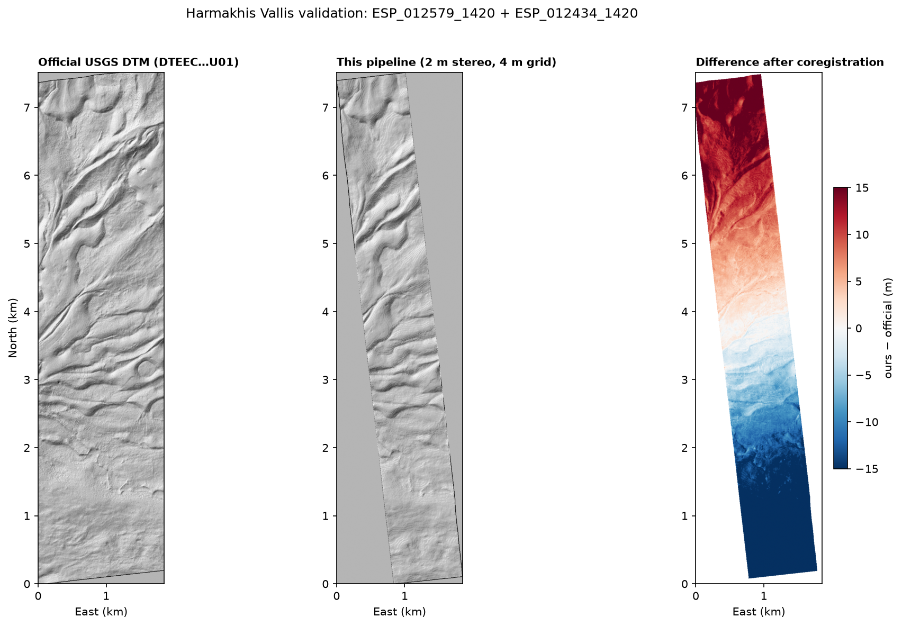

# HiRISE-dtm-pipeline

**Open-source stereogrammetry for HiRISE: raw stereo EDRs in, 4 m/px
digital terrain model out.** ISIS + Ames Stereo Pipeline, scripted end to
end, no manual tie-pointing, no commercial software. Demonstrated here on a
stereo pair that has no official DTM.


## Why

FRoST (Frankfurt Robotics Science Team) set Dao Vallis as the target of our
ERC 2026 science mission: put a rover into a Martian outflow canyon. That
decision has a data problem. Whether canyon walls are traversable depends
on slopes at rover scale, and the best public elevation product for our
sites is 125 m/px — two orders of magnitude too coarse. HiRISE has imaged
the area in stereo at 25–50 cm/px, but the official DTM program never
processed those pairs.

The scans we needed did not exist, so this pipeline makes them: it turns
any HiRISE stereo pair into a DTM with meter-class vertical precision. The
demonstration case is the *Juncture of branches of Dao Vallis*
(PSP_003468_1430 + PSP_003956_1430, −36.86°N 90.27°E), 39 km from our
mission zone. The downstream terrain assessment lives in
[Dao-Vallis-Descend](https://github.com/LouisPfirmann/Dao-Vallis-Descend).

## Result

| | |
|---|---|
| Product | `output/hirise_dtm_juncture.tif` — 4 m/px GeoTIFF, Mars sinusoidal, MOLA-areoid heights |
| Source pair | PSP_003468_1430 (23.3° roll) + PSP_003956_1430 (8.7° roll), ~32° convergence |
| Extent | 2.3 km × 13 km (RED4+RED5 CCDs) |
| Elevation range | −4,402 … −3,747 m |
| Median ray-intersection error | 0.5 m |
| Bundle-adjustment residuals | 0.3–0.7 px median reprojection |
| Coverage | 70–80 % of the stereo overlap |
| Vertical datum | tied to the USGS MOLA-HRSC blend: +6,226 m sphere→areoid, reproducible to ±2 m (`datum_tie.py`) |

`output/point_cloud_juncture_4m.ply` (719 k points) and the figure above
are generated by `hirise_dtm_analysis.py`.

## Validation and error analysis

Three tiers, from precision to absolute accuracy.

**Tier 1 — internal precision.** Median ray-intersection error 0.5 m;
bundle-adjustment reprojection residuals 0.3–0.7 px. This bounds noise,
not systematic error.

**Tier 2 — pipeline accuracy against an official product.** The identical
chain ([`validation/run_validation.sh`](validation/run_validation.sh)) was
run on ESP_012579_1420 + ESP_012434_1420 (Harmakhis Vallis) — a pair with
an official USGS-produced 1 m DTM,
[DTEEC_012579_1420_012434_1420_U01](https://www.uahirise.org/dtm/dtm.php?ID=ESP_012579_1420) —
and compared ([`validate_harmakhis.py`](validate_harmakhis.py), full
numbers in [`validation/stats.txt`](validation/stats.txt)):



| Error term | Value | Cause |
|---|---|---|
| Horizontal misregistration | 67 m | no ground control (SPICE + datum tie only) |
| Vertical bias | ≈ 30 m | datum tie vs MOLA-controlled reference |
| Tilt | 6.3 m/km | bundle adjustment without GCPs |
| **Surface error after removing the above** | **RMS 2.2 m, median 1.4 m** | stereo correlation itself |

The pipeline reproduces the official *surface* to ~2 m RMS. Its absolute
georeferencing is good to tens of meters — fine for slope and relief work,
not for products that must be absolutely positioned without further control.

One systematic difference matters downstream: at a common 4 m grid, this
pipeline's DTM reads lower slopes than the official product (30.8 % vs
38.4 % of area above 20 %; median 14.0 % vs 16.4 %) — the 2 m correlation
kernel smooths. **Treat slope statistics from this pipeline as lower
bounds on steepness.**

**Can the absolute error be fixed by registering to MOLA?** Tested
([`mola_tie.py`](mola_tie.py)): coregistering the Harmakhis DEM to the
MOLA-HRSC blend and re-validating against the official DTM makes things
*worse* — horizontal error 67 → 108 m, tilt 6.3 → 15 m/km. At 200 m/px
the blend's own local registration error exceeds the SPICE-only error, so
it cannot transfer horizontal control at this scale (the vertical datum
tie is its one reliable contribution, good to ~30 m). The genuine upgrade
path is `pc_align` against raw MOLA PEDR altimetry shots — per-shot ~1 m
vertical, the same control source the official pipeline uses. For slope
and descent work none of this matters: those conclusions ride on relative
accuracy, which is the 2.2 m RMS above.

**Tier 3 — scene check of the juncture DTM.** The Harmakhis run validates
the pipeline, not this scene, so the juncture DTM is additionally checked
against the independent HRSC h2609 strip at 125 m
([`scene_check_hrsc.py`](scene_check_hrsc.py)): relief agreement 98.5 %
(647 m vs 657 m), elevation correlation r = 0.93, residual RMS 76 m —
consistent with HRSC's own smoothing of canyon walls plus a
Harmakhis-scale tilt, and ruling out gross scene-level scale or
orientation error. (Absolute datum is not independently confirmed by this
tier: the datum tie and the HRSC-family products share heritage.)

## The chain

[`pipeline.sh`](pipeline.sh) is the complete command record, annotated,
dead ends included. In outline:

1. **EDR download** — raw RED4/RED5 channel products from the HiRISE PDS node.
2. **`hiedr2mosaic.py`** — ISIS chain (`hi2isis → hical → histitch →
   spiceinit → spicefit → noproj → hijitreg → handmos → cubenorm`) producing
   one calibrated, CCD-mosaicked cube per observation.
3. **`reduce`** to 1 m/px.
4. **Seed stereo** (MGM, uncontrolled) — run not for terrain but for its
   disparity field, exported as dense match points
   (`--num-matches-from-disparity`).
5. **`bundle_adjust`** on those dense matches → 0.3–0.7 px residuals.
6. **`reduce`** to 2 m/px for production stereo (see below for why).
7. **Controlled stereo** — MGM, 9×9 census kernel, affine-epipolar
   alignment, bundle-adjusted cameras.
8. **`point2dem`** at 4 m/px, with ray-intersection error image.
9. **Datum tie** — [`datum_tie.py`](datum_tie.py) shifts the
   sphere-referenced DEM onto the MOLA areoid via the median offset against
   the USGS MOLA-HRSC blend (windowed remote read).

Toolchain: [ISIS 8.3.0](https://github.com/DOI-USGS/ISIS3) and
[Ames Stereo Pipeline 3.7.0](https://stereopipeline.readthedocs.io), both
free, installed via micromamba. A few hours wall-clock on a 16-thread
laptop; ~8 GB scratch per pair.

## Failure modes on a low-contrast pair

This pair's image contrast is ~0.01 in I/F — the terrain is blanketed in
optically bland dust. That drove every deviation from the textbook chain:

- **`hijitreg` found no inter-CCD offsets** and fell back to zeros. Benign
  for this pair: the `noproj`ed CCDs were already co-registered to well
  under a pixel.
- **Sparse interest-point bundle adjustment starved** — too few tie points
  on textureless terrain. Fix: bootstrap dense matches from an uncontrolled
  stereo pass (steps 4–5 above).
- **Controlled stereo at 1 m/px left correlation holes across the dusty
  plains.** Production runs at 2 m/px with a 9×9 census kernel, trading
  resolution for 70–80 % coverage; the output grid is 4 m/px, consistent
  with the correlation scale.
- The University of Arizona lists this stereo pair but never released a
  DTM for it. After processing it, the low contrast is the plausible
  reason. Check a pair's dynamic range before committing compute.

## Prior art

Official PDS DTMs are produced with ISIS + SOCET SET — commercial BAE
Systems photogrammetry with interactive tie-pointing on licensed
workstations ([production manual](https://www.lpl.arizona.edu/hamilton/sites/lpl.arizona.edu.hamilton/files/courses/ptys551/Socet_Set_Manual.pdf)) —
a pipeline that cannot be cloned. The open-source route is documented in
the [ASP manual](https://stereopipeline.readthedocs.io) and
[Hepburn et al. 2019](https://gi.copernicus.org/articles/8/293/2019/);
this repo builds on both. What it adds: a complete worked example on a
pair the official program never processed — fully automated, failed
parameter iterations documented next to the ones that worked, and
validated against an official product.

## Contents

```
pipeline.sh              full command chain, annotated (a record, not an installer)
datum_tie.py             sphere → MOLA-areoid datum tie (uv script)
hirise_dtm_analysis.py   slope statistics, map figure, point-cloud export (uv script)
validate_harmakhis.py    comparison vs the official USGS DTM (uv script)
scene_check_hrsc.py      long-wavelength check vs HRSC 125 m strip (uv script)
mola_tie.py              register a DEM to the MOLA-HRSC blend (uv script; see Validation)
output/
  hirise_dtm_juncture.tif      the DTM (4 m/px, areoid heights)
  hirise_dtm_maps.png          elevation + slope figure
  point_cloud_juncture_4m.ply  719k-point cloud (local meters, centered)
validation/
  run_validation.sh            the Harmakhis validation run, end to end
  comparison.png               official vs pipeline + difference map
  stats.txt                    full comparison numbers
```

Python scripts are single-file [uv](https://docs.astral.sh/uv/) scripts —
`uv run <script>`, no environment setup.

## Data credits & license

- HiRISE EDR imagery: NASA / JPL / University of Arizona
- ISIS: USGS Astrogeology Science Center
- Ames Stereo Pipeline: NASA Ames Research Center
- MOLA-HRSC blended DEM: USGS Astrogeology / NASA / ESA-DLR-FU Berlin

Code under the MIT license ([LICENSE](LICENSE)). Derived data products in
`output/` come from NASA public-domain imagery.

*Louis Pfirmann, FRoST — ERC 2026.*
