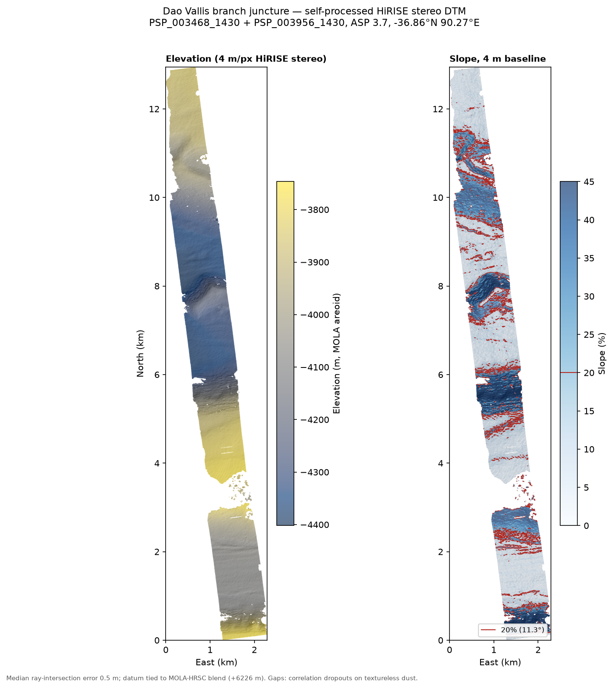

# HiRISE-dtm-pipeline

**A 4 m/px Mars digital terrain model, built from raw HiRISE stereo imagery
with a fully open-source, fully scripted chain — for a stereo pair that has
no official DTM.**



Site: *Juncture of branches of Dao Vallis* (−36.86°N, 90.27°E, Hellas
region), 39 km from the mission zone I was assessing. I needed meter-class
topography to judge whether canyon-wall slopes are traversable by a rover;
no elevation product better than 125 m/px existed for the area. So this
repo builds one.

Developed as my groundwork for the science task of **FRoST — Frankfurt
Robotics Science Team**'s ERC 2026 entry. The downstream terrain
assessment lives in
[dao-vallis-descend](https://github.com/LouisPfirmann/dao-vallis-descend).

## Result

| | |
|---|---|
| Product | `output/hirise_dtm_juncture.tif`, 4 m/px, GeoTIFF (Mars sinusoidal, MOLA-areoid heights) |
| Source pair | PSP_003468_1430 (23.3° roll) + PSP_003956_1430 (8.7° roll) → ~32° convergence |
| Extent | 2.3 km-wide strip (RED4+RED5 CCDs), 13 km along-track |
| Elevation range | −4,402 … −3,747 m |
| Median ray-intersection error | **0.5 m** |
| Bundle adjustment residuals | 0.3–0.7 px median reprojection |
| Coverage | ~70–80 % of the stereo overlap (gaps: correlation dropouts on textureless dust) |
| Vertical datum | tied to the USGS MOLA-HRSC blend, +6,226 m sphere→areoid (independently reproduced to ±2 m by `datum_tie.py`) |

Also included: `output/point_cloud_juncture_4m.ply` (719 k points) and the
slope/elevation figure above (`hirise_dtm_analysis.py`).

## Validation against an official USGS DTM

<!-- VALIDATION: filled after the Harmakhis Vallis comparison run -->
*In progress: the identical chain, run on ESP_012579_1420 + ESP_012434_1420
(Harmakhis Vallis) — a pair with an official USGS-produced DTM
([DTEEC_012579_1420_012434_1420_U01](https://www.uahirise.org/dtm/dtm.php?ID=ESP_012579_1420))
— with elevation-difference and slope-statistics comparison. Numbers and
figure land here.*

## The chain

Everything is in [`pipeline.sh`](pipeline.sh) — the actual commands run,
annotated, including the dead ends. Summary:

1. **EDR download** — raw RED4/RED5 channel products from the HiRISE PDS node.
2. **`hiedr2mosaic.py`** (ASP wrapper around ISIS): `hi2isis → hical →
   histitch → spiceinit → spicefit → noproj → hijitreg → handmos →
   cubenorm` — one calibrated, CCD-mosaicked cube per observation.
3. **`reduce`** to 1 m/px (from 0.5 m native, bin-2).
4. **Seed stereo** (`parallel_stereo`, MGM, uncontrolled) — not for terrain:
   its dense disparity field becomes the match file for step 5.
5. **`bundle_adjust`** on dense matches — sparse interest-point matching
   found too few points on this low-contrast pair; feeding the seed run's
   disparities in (`--match-files-prefix`) got residuals to 0.3–0.7 px.
6. **`reduce`** to 2 m/px for production stereo (see "What went wrong").
7. **Controlled stereo** — MGM, 9×9 census kernel, affine-epipolar
   alignment, bundle-adjusted cameras.
8. **`point2dem`** at 4 m/px + ray-intersection error image.
9. **Datum tie** — [`datum_tie.py`](datum_tie.py) shifts the sphere-referenced
   DEM onto the MOLA areoid by the median offset against the USGS MOLA-HRSC
   blend (read remotely, windowed; nothing downloaded in full).

Toolchain: [ISIS 8.3.0](https://github.com/DOI-USGS/ISIS3) +
[Ames Stereo Pipeline 3.7.0](https://stereopipeline.readthedocs.io), both
free, installed via micromamba. Wall-clock: a few hours on a 16-thread
laptop, ~8 GB scratch.

## What went wrong (and why there's probably no official DTM)

The honest part of the walkthrough — none of this is in the manuals:

- **The pair's image contrast is ~0.01 in I/F.** This part of Hellas is
  blanketed in optically bland dust. Consequences everywhere downstream.
- **`hijitreg` failed** to find inter-CCD offsets (too little texture) and
  fell back to zero offsets — harmless here, but the warning is alarming
  the first time you see it.
- **Sparse bundle adjustment starved.** Standard interest-point matching
  produced too few tie points; the fix was bootstrapping dense matches from
  an uncontrolled stereo pass.
- **1 m controlled stereo mostly didn't correlate.** The production run at
  1 m/px left holes across most of the dusty plains. Dropping to 2 m/px
  with a 9×9 census-transform kernel traded resolution for ~70–80 %
  coverage. The published grid is 4 m/px, consistent with that correlation
  scale.
- The University of Arizona's HiRISE team lists this stereo pair but never
  released a DTM for it. Having processed it, I believe the contrast is the
  reason. If you're picking your own pair: check the I/F dynamic range
  *before* committing compute.

## Prior art, and what this adds

Official PDS DTMs are produced with ISIS + **SOCET SET** — commercial BAE
Systems photogrammetry software with manual tie-pointing on licensed
workstations ([workflow manual](https://www.lpl.arizona.edu/hamilton/sites/lpl.arizona.edu.hamilton/files/courses/ptys551/Socet_Set_Manual.pdf)).
That pipeline is not something you can clone. The open-source route is
documented in the [ASP manual](https://stereopipeline.readthedocs.io) and in
[Hepburn et al. 2019](https://gi.copernicus.org/articles/8/293/2019/), which
this work leans on. What this repo adds is a complete, warts-in worked
example on a *hard* pair — automated end to end (no manual tie-pointing),
with the parameter iterations that failed documented alongside the ones that
worked, and validated against an official product.

## Repo contents

```
pipeline.sh              the full command chain, annotated (record, not installer)
datum_tie.py             sphere -> MOLA-areoid vertical datum tie (uv script)
hirise_dtm_analysis.py   slope stats, maps figure, point cloud export (uv script)
output/
  hirise_dtm_juncture.tif      the DTM (4 m/px, areoid heights)
  hirise_dtm_maps.png          elevation + slope figure
  point_cloud_juncture_4m.ply  719k-point cloud (local meters, centered)
```

Python scripts are single-file [uv](https://docs.astral.sh/uv/) scripts:
`uv run hirise_dtm_analysis.py`.

## Data credits & license

- HiRISE EDR imagery: NASA/JPL/University of Arizona
- ISIS: USGS Astrogeology Science Center
- Ames Stereo Pipeline: NASA Ames Research Center (Intelligent Robotics Group)
- MOLA-HRSC blended DEM: USGS Astrogeology / NASA / ESA-DLR-FU Berlin

Code: MIT license (see [LICENSE](LICENSE)). Data products in `output/` are
derived from NASA public-domain imagery — use them, cite the repo.

*Louis Pfirmann — FRoST, ERC 2026. Personal work; not a team publication.*
